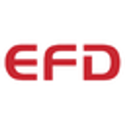
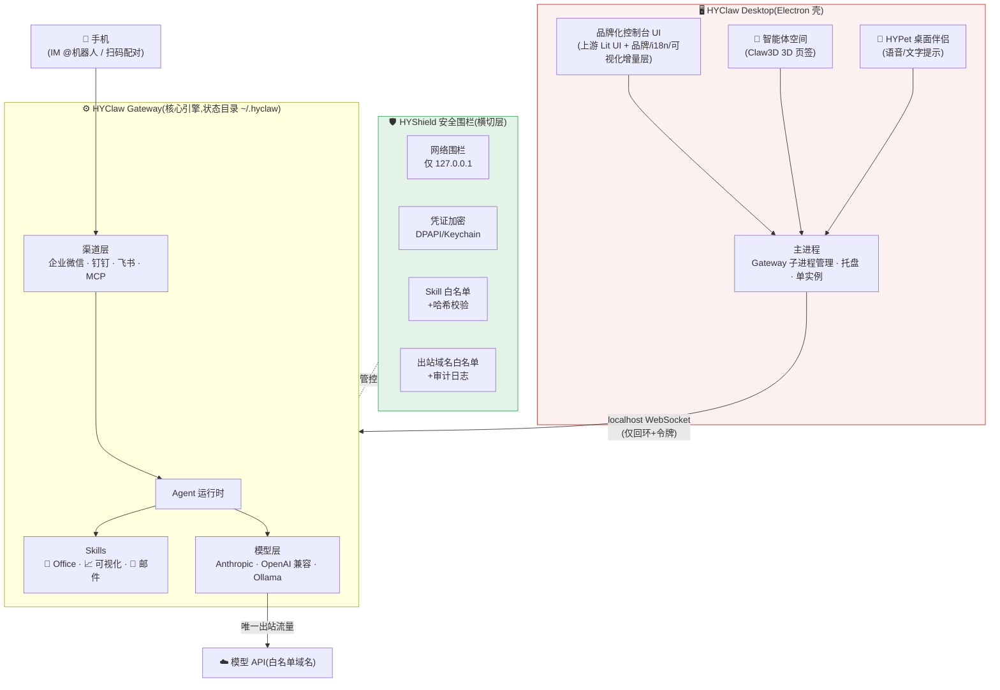
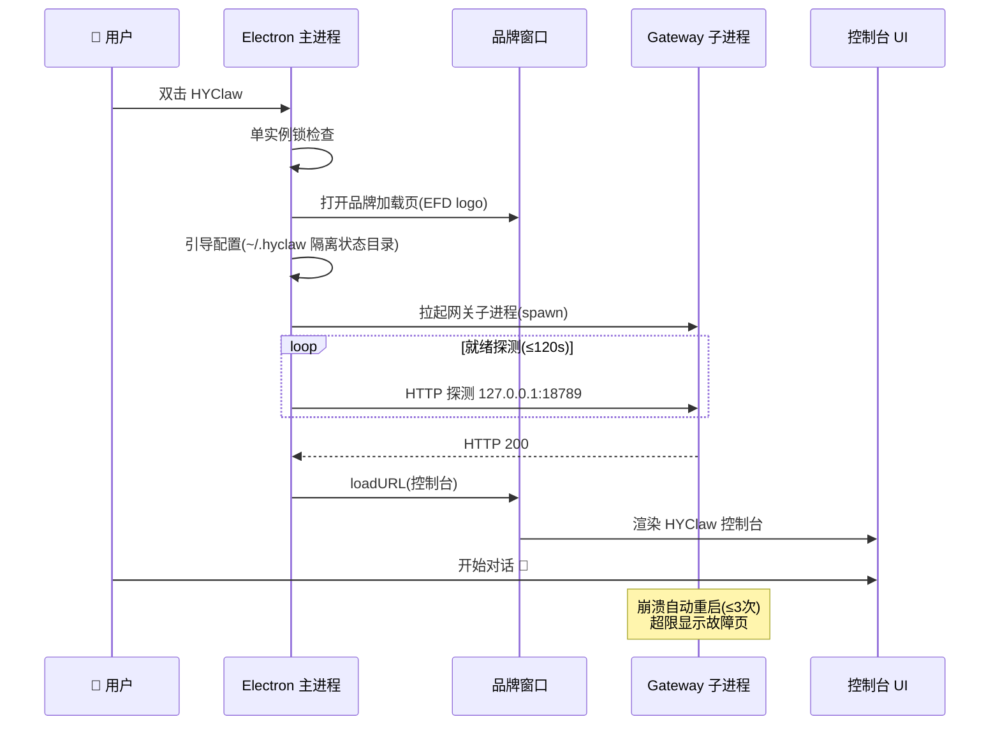
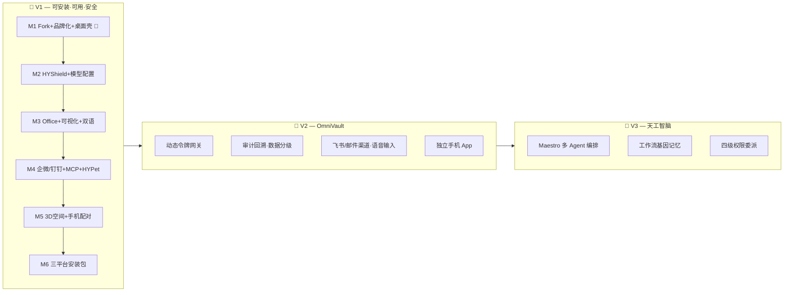

<div align="center">



# HYClaw · 和熠智脑

**EFD 和熠光显 · 企业级本地优先 AI 工作台**

_企业级 · 本地优先 · 安全可控的 AI 员工工作台_

<p>
  <a href="LICENSE"></a>
  
  
  
</p>
<p>
  
  
  
</p>
<p>
  
  
</p>

[设计文档](docs/superpowers/specs/2026-07-16-hyclaw-v1-design.md) ·
[验收标准](docs/superpowers/specs/2026-07-16-hyclaw-v1-acceptance.md) ·
[实施计划](docs/superpowers/plans/2026-07-16-m1-fork-brand-electron-shell.md)

</div>

---

## 简介 | Introduction

**HYClaw(和熠智脑)** 由 **EFD 和熠光显** 打造,基于成熟的开源 AI 网关引擎(MIT 协议)深度定制。它把强大的个人 AI 助手网关改造成一个**可安装、可管控、数据不出本机**的企业员工工作台:

> **HYClaw** is an enterprise AI workbench by EFD, built on a mature open-source AI gateway engine (MIT). Installable, security-fenced, local-first — with Office document skills, data visualization, Chinese-first bilingual UI, and a hardened security layer (HYShield).

三大差异化支柱:

| 支柱                     | 说明                                                                                                       |
| ------------------------ | ---------------------------------------------------------------------------------------------------------- |
| 🛡️ **HYShield 安全围栏** | 针对上游公开安全问题逐条设防:仅回环绑定、强制令牌、密钥加密落盘、skill 白名单、出站域名白名单、IM 注入防护 |
| 📊 **Office + 可视化**   | Word / Excel / PowerPoint / PDF 读写改汇总,ECharts 图表面板,报告一键生成                                   |
| 🌏 **中文优先双语**      | zh-CN 默认、en-US 一键切换,中文问答专项调优                                                                |

## 功能特性 | Features

- 🖥️ **桌面应用**:Electron 壳,Windows / macOS / Linux 三平台,NSIS 安装向导可自选路径(QClaw 同款形态)
- 🤖 **多模型接入**:Anthropic API / OpenAI 兼容端点(DeepSeek、通义、Kimi、内网私有模型)/ Ollama 本地模型
- 📄 **Office 文档**:docx / xlsx / pptx / pdf 四件套 skills,工作区路径围栏
- 📈 **数据可视化**:Agent 分析数据 → ECharts 实时渲染 → 导出 PNG / 嵌入报告
- 💬 **企业 IM 渠道**:企业微信、钉钉(官方 API);飞书 V1.5;个人微信实验性(默认关闭)
- 🔌 **通用 MCP**:ERP / 数据库 / OA 等企业系统统一接入口
- 🐾 **HYPet 桌面伴侣**:悬浮桌宠、语音+文字主动提示、前台应用感知
- 🏢 **智能体空间**:基于 Claw3D 的 3D 虚拟办公室,多 Agent 活动可视化
- 📱 **手机互联**:IM 即手机端(零配置)+ 局域网扫码配对

## 总体架构 | Architecture



### 启动流程 | Startup Sequence



## 路线图 | Roadmap



### 里程碑进度 | Milestones

| 里程碑 | 内容                              | 状态    |
| ------ | --------------------------------- | ------- |
| M1     | Fork + 品牌化 + Electron 壳       | ✅ 完成 |
| M2     | HYShield 安全围栏 + 模型配置页    | ⏳ 排队 |
| M3     | Office skills + 数据可视化 + 双语 | ⏳ 排队 |
| M4     | 企微/钉钉 + MCP + HYPet 桌宠      | ⏳ 排队 |
| M5     | 智能体空间(3D)+ 手机局域网配对    | ⏳ 排队 |
| M6     | 三平台安装包 + 仓库迁移收尾       | ⏳ 排队 |

## 快速开始 | Quick Start

> 员工用户请等待 M6 安装包(`HYClaw-Setup-x.y.z.exe`,离线安装,向导可自选路径)。以下为开发者路径。

```bash
# 环境:Node ≥22.22 / pnpm 11.2(corepack)
pnpm install                          # 安装依赖
pnpm build                            # 构建 Gateway + 控制台
pnpm --filter @hyclaw/desktop start   # 启动桌面版 🚀
```

## 开发 | Development

```bash
pnpm --filter @hyclaw/desktop test      # 桌面壳单元测试(vitest)
pnpm --filter @hyclaw/desktop pack:dir  # 打包 win-unpacked(不出安装器)
pnpm ui:build                           # 单独构建控制台 UI
```

### 项目结构(相对上游的新增)

```
apps/desktop/        # Electron 桌面壳(主进程/窗口/托盘/网关管理)
branding/            # EFD 品牌资产 + 图标生成管线
packages/hyshield/   # 安全围栏(M2)
skills/hy-office/    # Office skills(M3)
skills/hy-dataviz/   # 可视化 skill(M3)
apps/agent-space/    # Claw3D 智能体空间(M5)
docs/superpowers/    # 设计文档 · 实施计划 · 验收标准
```

### 代码规范

- 上游规范:oxlint + oxfmt + vitest;我们的新代码同样遵守
- TypeScript strict,全 ESM,单文件 <400 行
- 提交格式:`<type>: <description>`(feat/fix/refactor/docs/test/chore)
- **最小侵入原则**:改动收敛在新增目录,便于每月合并上游安全补丁

## 上游同步 | Upstream Sync

```bash
git fetch upstream main
git merge upstream/main   # 每月一次;冲突集中在 README/品牌点,按 ours 处理
pnpm install && pnpm build && pnpm --filter @hyclaw/desktop test
```

## 安全 | Security

HYShield 针对上游已公开的安全问题逐条设防,详见[设计文档第 5 节](docs/superpowers/specs/2026-07-16-hyclaw-v1-design.md)。**一票否决项**:明文密钥落盘、监听 0.0.0.0、安装需联网、个人微信默认开启——任何一条存在,版本不得发布(见[验收标准](docs/superpowers/specs/2026-07-16-hyclaw-v1-acceptance.md))。

发现安全问题请直接联系维护者,勿提公开 issue。

## 许可 | License

[MIT](LICENSE) — 本项目基于[上游开源项目](https://github.com/openclaw/openclaw)(MIT 协议)二次开发,上游版权与许可声明完整保留于 [LICENSE](LICENSE);HYClaw 新增部分 © 2026 EFD 和熠光显。

<div align="center">
<sub>Built with ❤️ by EFD 和熠光显</sub>
</div>
